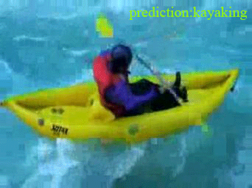

# Video Classification

The repository builds a **quick and simple** code for video classification (or action recognition) using [UCF101](http://crcv.ucf.edu/data/UCF101.php) with PyTorch. A video is viewed as a 3D image or several continuous 2D images (Fig.1). Below are two simple neural nets models:


## Dataset




[UCF101](http://crcv.ucf.edu/data/UCF101.php) has total 13,320 videos from 101 actions. Videos have various time lengths (frames) and different 2d image size; the shortest is 29 frames. 

To avoid painful video preprocessing like frame extraction and conversion such as [OpenCV](https://opencv.org/) or [FFmpeg](https://www.ffmpeg.org/), here I used a preprocessed dataset from [feichtenhofer](https://github.com/feichtenhofer/twostreamfusion) directly. If you want to convert or extract video frames from scratch, here are some nice tutorials: 
  - https://pythonprogramming.net/loading-video-python-opencv-tutorial/
  - https://www.pyimagesearch.com/2017/02/06/faster-video-file-fps-with-cv2-videocapture-and-opencv/ 

## Models 

### 1. 3D CNN (train from scratch)
Use several 3D kernels of size *(a,b,c)* and channels *n*,  *e.g., (a, b, c, n) = (3, 3, 3, 16)* to convolve with video input, where videos are viewed as 3D images. *Batch normalization* and *dropout* are also used.


### 2. **CNN + RNN** (CRNN)

The CRNN model is a pair of CNN encoder and RNN decoder (see figure below):

  - **[encoder]** A [CNN](https://en.wikipedia.org/wiki/Convolutional_neural_network) function encodes (meaning compressing dimension) every 2D image **x(t)** into a 1D vector **z(t)** by 

  - **[decoder]** A [RNN](https://en.wikipedia.org/wiki/Recurrent_neural_network) receives a sequence input vectors **z(t)** from the CNN encoder and outputs another 1D sequence **h(t)**. A final fully-connected neural net is concatenated at the end for categorical predictions. 
  
  - Here the decoder RNN uses a long short-term memory [(LSTM)](https://en.wikipedia.org/wiki/Long_short-term_memory) network and the CNN encoder can be:
    1. trained from scratch
    2. a pretrained model [ResNet-152](https://arxiv.org/abs/1512.03385) using image dataset [ILSVRC-2012-CLS](http://www.image-net.org/challenges/LSVRC/2012/).


## Training & testing
- For 3D CNN:
   1. The videos are resized as **(t-dim, channels, x-dim, y-dim) = (29, 3, 256, 342)** since CNN requires a fixed-size input. The minimal frame number 29 is the consensus of all videos in UCF101.
   2. *Batch normalization*, *dropout* are used.
   
- For CRNN, the videos are resized as **(t-dim, channels, x-dim, y-dim) = (29, 3, 224, 224)** since the ResNet-152 only receives RGB inputs of size (224, 224).

- Training videos = **9,990** vs. testing videos = **3,330**

- In the test phase, the models are almost the same as the training phase, except that dropout has to be removed and batchnorm layer uses moving average and variance instead of mini-batch values. These are taken care by using "**model.eval()**".


## Usage 
For tutorial purpose, I try to build code as simple as possible. Essentially, **only 3 files are needed to for each model**. *eg.,* for 3D-CNN model
  - `UCF101_3DCNN.py`: model parameters, training/testing process.
  - `function.py`: modules of 3DCNN & CRNN, data loaders, and some useful functions.
  - `UCF101actions.pkl`: 101 action names (labels), e.g, *'BenchPress', 'SkyDiving' , 'Bowling', etc.*

### 0. Prerequisites
- [Python 3.6](https://www.python.org/)
- [PyTorch 1.0.0](https://pytorch.org/)
- [Numpy 1.15.0](http://www.numpy.org/)
- [Sklearn 0.19.2](https://scikit-learn.org/stable/)
- [Matplotlib](https://matplotlib.org/)
- [Pandas](https://pandas.pydata.org/)
- [tqdm](https://github.com/tqdm/tqdm)


### 1. Download preprocessed UCF101 dataset
For convenience, we use preprocessed UCF101 dataset already sliced into RGB images [feichtenhofer/twostreamfusion](https://github.com/feichtenhofer/twostreamfusion):


- **UCF101 RGB:** [**part1**](http://ftp.tugraz.at/pub/feichtenhofer/tsfusion/data/ucf101_jpegs_256.zip.001),
[**part2**](http://ftp.tugraz.at/pub/feichtenhofer/tsfusion/data/ucf101_jpegs_256.zip.002),
[**part3**](http://ftp.tugraz.at/pub/feichtenhofer/tsfusion/data/ucf101_jpegs_256.zip.003) 


Put the 3 parts in same folder to unzip. The folder has default name: **jpegs_256**.


### 2. Set parameters & path

In `UCF101_CRNN.py`, for example set 
```
data_path = "./UCF101/jpegs_256/"         # UCF101 video path
action_name_path = "./UCF101actions.pkl"
save_model_path = "./model_ckpt/"
```

### 3. Train & test model

- For **3D CNN/ CRNN/ ResNetCRNN** model, in each folder run
```bash
$ python UCF101_3DCNN/CRNN/ResNetCRNN.py    
```


### 4. Model ouputs

By default, the model outputs:

- Training & testing loss/ accuracy: `epoch_train_loss/score.npy`, `epoch_test_loss/score.npy`

- Model parameters & optimizer: eg. `CRNN_epoch8.pth`, `CRNN_optimizer_epoch8.pth`. They can be used for retraining or pretrained purpose.

To check model prediction:
  - Run ``check_model_prediction.py`` to load best training model and generate all 13,320 video prediction list in [Pandas](https://pandas.pydata.org/) dataframe. File output: `UCF101_Conv3D_videos_prediction.pkl`.
  - Run `check_video_predictions.ipynb` with [Jupyter Notebook](http://jupyter.org/) and you can see where the model gets wrong:


## Device & performance 

- The models detect and use multiple GPUs by themselves, where we implemented [torch.nn.DataParallel](https://pytorch.org/tutorials/beginner/former_torchies/parallelism_tutorial.html).

- A field test using 2 GPUs (nVidia TITAN V, 12Gb mem) with my default model parameters and batch size `30~60`.

- Some **pretrained models** can be found [here](https://drive.google.com/open?id=117mRMS2r09fz4ozkdzN4cExO1sFwcMvs), thanks to the suggestion of [MinLiAmoy](https://github.com/MinLiAmoy?tab=repositories).


 network                | best epoch | testing accuracy |
------------            |:-----:| :-----:|
3D CNN                  |   4  |  50.84 % | 
2D CNN + LSTM           |  25  |  54.62 % | 
2D ResNet152-CNN + LSTM |  53  |**85.68 %** |      


<br>
